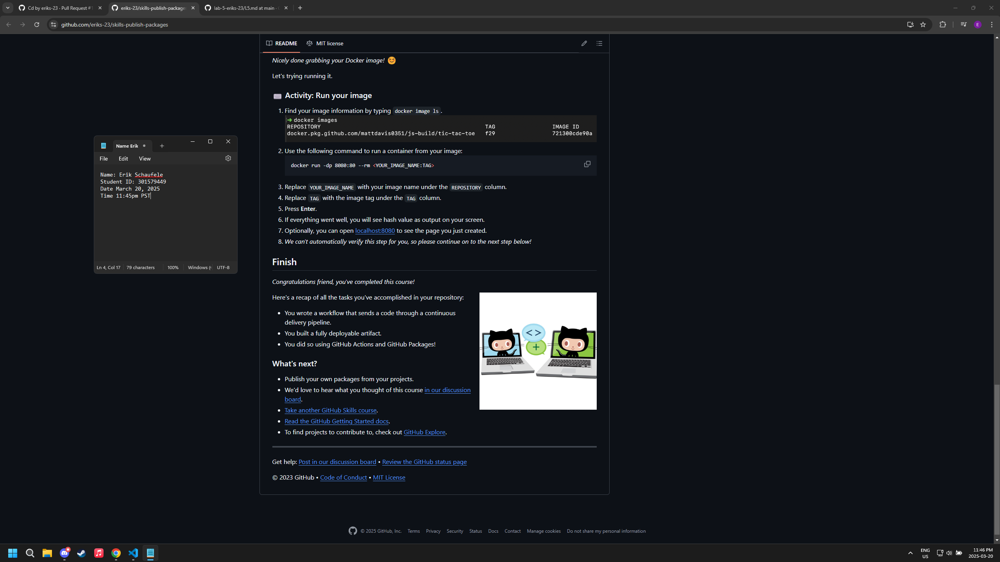
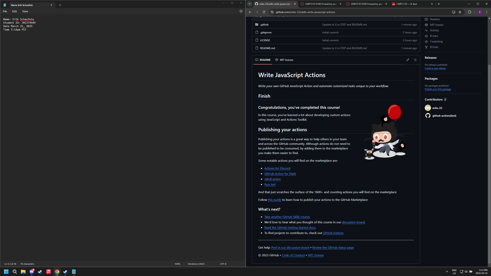

# 276-Lab5

## Github Skills

### Publish to Github Packages

### Write JavaScript Actions

## Github Video Questions

git commit --am "this is a test"
This command is like an automatic "git add ." + a commit. It stages and commits all modified files in the single command.

git commit --amend
This command updates the last commit with new files without creating a new one.

git stash
This command stashes away local file changes to be retrieved for later use without committing them to the repository.

## Docker Video Questions

1. Why are Docker images made up of layers and how does the layering structure benefit the process of building images?

The images being made of layers benefits the process of building images because it allows for reusability since the common layers can be shared among different images namely the parent image as it may not be changed as much as the dependencies or run commands for example. Furthermore, the layering structure can help ensure consistent behaviour and more optimized storage as we aren't completely rebuilding the image from scratch for each small change.

2. What is the purpose of a Dockerfile in creating a Docker image?

A Dockerfile is akin to a set of instructions for Docker to create a Docker image. The Dockerfile lists all the different layers that make up the image.

3. List and briefly explain the basic instructions used in a Dockerfile for building a Node.js Docker image.

In the Dockerfile the instructions are: 1. FROM node:17-alpine this instruction says to begin we pull in the node image as our initial layer note that we are using version 17 of node with the alpine distrubution of linux. 2. WORKDIR /app this instruction tells Docker that when we run future commands on the image we do it from the "/app" directory. 3. COPY . . this instruction copies some files to the image the first "." is a relative path to the directory that we want to copy our source files from, the second "." is the path inside the image that we want to copy our source code to in both cases the "." is just the root directory. 4. RUN npm install this instruction runs the command "npm install", installing all the dependencies we need. 5. EXPOSE 4000 this command indicates port 4000 for which the container will listen for connections. 6. CMD ["node", "app.js"] this command is specifes the commands to be run at runtime when the container begins to run in this case "node" and "app.js".